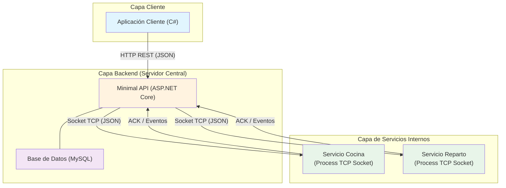

# Esquema de Arquitectura Distribuida

**Proyecto:** PizzeriaAPI
**Curso:** Computación — ET12 DE1

---

## 1. Diagrama General de la Arquitectura



---

## 2. Tipo de Comunicación entre Módulos

| Conexión | Protocolo | Formato | Tipo | Características |
|----------|-----------|---------|------|-----------------|
| **Cliente ↔ Backend** | HTTP 1.1 | JSON | Síncrona (request/response) | RESTful, stateless. El cliente siempre inicia. |
| **Backend ↔ Cocina** | TCP Socket | JSON (delimitado por newline) | Asíncrona (eventos) | Conexión persistente. Backend envía pedido; Cocina responde cuando termina. |
| **Backend ↔ Reparto** | TCP Socket | JSON (delimitado por newline) | Asíncrona (eventos) | Misma mecánica que Cocina. |

### Detalle de mensajes intercambiados

#### HTTP (Cliente → Backend)
```
POST /api/pedidos
Content-Type: application/json

{
  "clienteEmail": "juan.perez@email.com",
  "items": [
    { "pizzaNombre": "Pizza Muzzarella", "cantidad": 2 },
    { "pizzaNombre": "Pizza Pepperoni", "cantidad": 1 }
  ]
}

→ Response 201:
{
  "pedidoId": 42,
  "estado": "EnPreparacion",
  "total": 3200.00
}
```

#### Socket TCP (Backend → Cocina)
```
→ Envío inicial:
{ "accion": "nuevo_pedido", "pedidoId": 42, "items": [ ... ] }

← ACK inmediato:
{ "accion": "ack", "pedidoId": 42, "status": "recibido" }

← Evento asíncrono (segundos después):
{ "accion": "pedido_preparado", "pedidoId": 42 }
```

#### Socket TCP (Backend → Reparto)
```
→ Envío inicial:
{ "accion": "asignar_entrega", "pedidoId": 42, "direccion": "Av. Siempreviva 742" }

← ACK inmediato:
{ "accion": "ack", "pedidoId": 42, "status": "recibido" }

← Evento asíncrono (segundos después):
{ "accion": "pedido_entregado", "pedidoId": 42 }
```

---

## 3. Flujo de Mensajes y Estados

```
Tiempo     Cliente              Backend                  Cocina              Reparto
  |          |                     |                       |                    |
  |          |──POST /pedidos─────>|                       |                    |
  |          |                     |──Socket: nuevo_pedido─>|                    |
  |          |                     |<──ACK ────────────────|                    |
  |          |<──201 Created───────|                       |                    |
  |          |  (EnPreparacion)    |                       |                    |
  |          |                     |                       |──(coccion delay)──>|
  |          |                     |<──Socket: preparado ──|                    |
  |          |                     |──Socket: asignar──────|───────────────────>|
  |          |                     |                       |                    |
  |          |──GET /pedidos/42───>|                       |                    |
  |          |<──200 (EnViaje)────|                       |                    |
  |          |                     |                       |                    |──(entrega delay)──>
  |          |                     |<──Socket: entregado ──|────────────────────|
  |          |──GET /pedidos/42───>|                       |                    |
  |          |<──200 (Entregado)──|                       |                    |
  v          v                     v                       v                    v
```

---

## 4. Desacople Temporal (Asincronía)

Un punto crítico del diseño es que **la respuesta HTTP 201 se envía antes de que la Cocina termine de preparar**. Esto se logra mediante:

```
POST /pedidos:
  1. Validar y persistir (Estado: EsperaConfirmacion)
  2. Conectar socket con Cocina
  3. Recibir ACK
  4. Estado = EnPreparacion
  5. RESPONDER HTTP 201 ← Acá vuelve la respuesta al cliente
  6. (El hilo sigue escuchando eventos socket)
  7. Evento → "PedidoPreparado" → Estado = EnViaje
  8. Evento → "PedidoEntregado" → Estado = Entregado
```

El cliente no bloquea esperando la pizza; consulta el estado mediante GET periódicos (polling).

---

## 5. Resumen de Endpoints

| Método | Ruta | Propósito | Request Body | Response |
|--------|------|-----------|--------------|----------|
| `POST` | `/api/pedidos` | Crear pedido | `{ clienteEmail, items[] }` | `201` + `{ pedidoId, estado, total }` |
| `GET` | `/api/pedidos/{id}` | Consultar estado | — | `200` + `{ pedidoId, estado, ... }` |
| `POST` | `/api/clientes` | Registrar cliente | `{ nombre, email, telefono, direccion }` | `201` + `{ clienteId }` |
