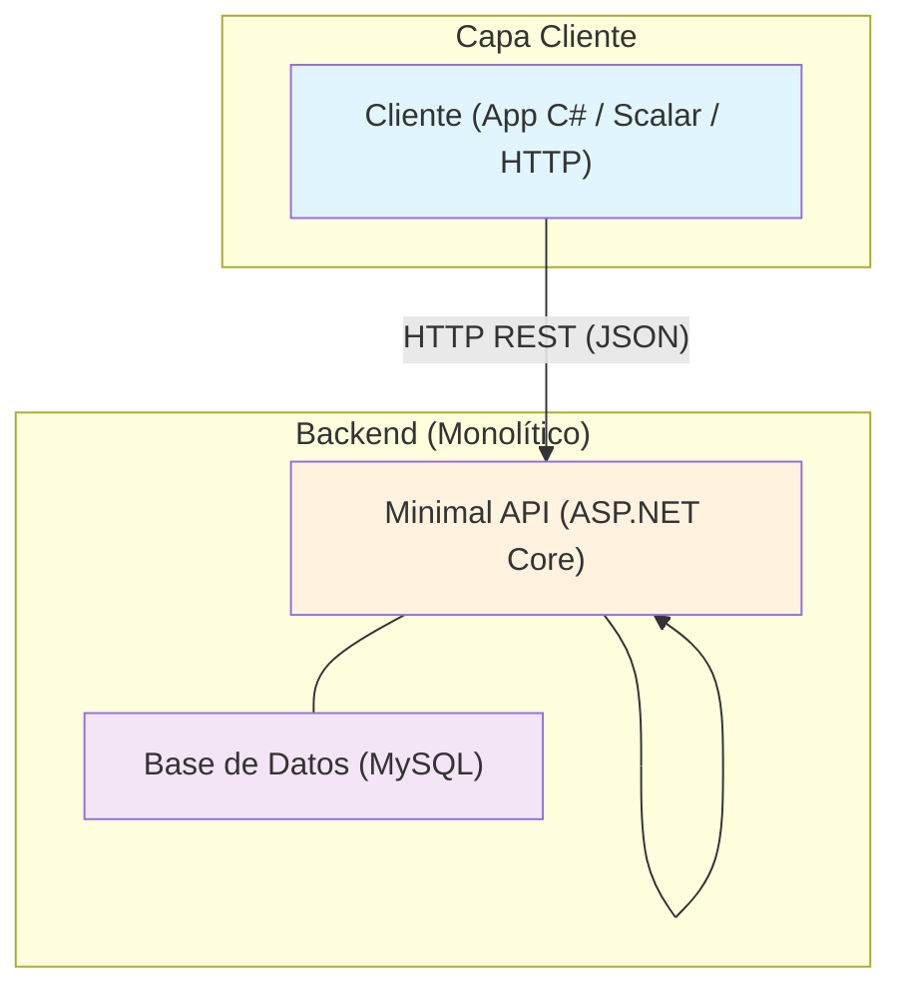

# Esquema de Arquitectura

**Proyecto:** PizzeriaAPI
**Curso:** Computación — ET12 DE1

---

## 1. Diagrama General de la Arquitectura


```mermaid
graph TB
    subgraph "Capa Cliente"
        APP["Cliente (App C# / Scalar / HTTP)"]
    end

    subgraph "Backend (Monolítico)"
        API["Minimal API (ASP.NET Core)"]
        DB["Base de Datos (MySQL)"]
        API --- DB
    end

    APP -- "HTTP REST (JSON)" --> API
    API --> API

    style APP fill:#e1f5fe
    style API fill:#fff3e0
    style DB fill:#f3e5f5
```

El sistema es **monolítico**: un único proceso backend (la API) concentra toda la lógica de negocio, la validación, la persistencia y la gestión de la máquina de estados del pedido. No existen servicios externos (cocina/reparto) conectados por socket.

---

## 2. Tipo de Comunicación entre Módulos

| Conexión | Protocolo | Formato | Tipo | Características |
|----------|-----------|---------|------|-----------------|
| **Cliente ↔ Backend** | HTTP 1.1 | JSON | Síncrona (request/response) | RESTful, stateless. El cliente siempre inicia. |

Todos los cambios de estado del pedido se realizan por HTTP, de forma explícita y controlada.

### Detalle de mensajes intercambiados

#### HTTP (Cliente → Backend) — Crear pedido
```
POST /api/pedidos
Content-Type: application/json

{
  "clienteEmail": "juan.perez@email.com",
  "items": [
    { "pizzaNombre": "Pizza Muzzarella", "cantidad": 2 },
    { "pizzaNombre": "Pizza Pepperoni", "cantidad": 1 }
  ]
}

→ Response 201:
{
  "pedidoId": 42,
  "estado": "EsperaConfirmacion",
  "total": 3900.00
}
```

#### HTTP (Administrador → Backend) — Transiciones de estado
```
PATCH /api/pedidos/42/estado
Content-Type: application/json

{ "estado": "EnPreparacion", "observacion": "Cocina aceptó el pedido" }

→ Response 200:
{ "pedidoId": 42, "estado": "EnPreparacion" }
```

---

## 3. Flujo de Estados

```
Tiempo     Cliente/Admin              Backend             Base de Datos
  |            |                        |                      |
  |            |──POST /pedidos───────>|                      |
  |            |                        |──INSERT pedido──────>|
  |            |<──201 Created─────────|                      |
  |            |  (EsperaConfirmacion) |                      |
  |            |──PATCH EnPreparacion─>|                      |
  |            |                        |──UPDATE estado──────>|
  |            |<──200─────────────────|                      |
  |            |──PATCH EnViaje───────>|                      |
  |            |                        |──UPDATE estado──────>|
  |            |<──200─────────────────|                      |
  |            |──GET /pedidos/42─────>|                      |
  |            |<──200 (EnViaje)───────|                      |
  |            |──PATCH Entregado─────>|                      |
  |            |                        |──UPDATE estado──────>|
  |            |<──200─────────────────|                      |
  |            |──GET /pedidos/42─────>|                      |
  |            |<──200 (Entregado)─────|                      |
  v            v                        v                      v
```

---

## 4. Desacople y Sincronía

El flujo es **síncrono y explícito**. No hay eventos asíncronos de terceros:

```
POST /pedidos:
  1. Validar y persistir (Estado: EsperaConfirmacion)
  2. Responder HTTP 201

PATCH /pedidos/{id}/estado:
  1. Verificar que el pedido existe
  2. Guardar nuevo estado + historial (transacción)
  3. Responder HTTP 200
```

Cada transición de estado queda registrada en `HISTORIAL_ESTADO_PEDIDO` (trazabilidad completa). El cliente consulta el estado mediante GET periódicos (polling).

---

## 5. Resumen de Endpoints

| Método | Ruta | Propósito | Request Body | Response |
|--------|------|-----------|--------------|----------|
| `POST` | `/api/pedidos` | Crear pedido | `{ clienteEmail, items[] }` | `201` + `{ pedidoId, estado, total }` |
| `GET` | `/api/pedidos/{id}` | Consultar estado | — | `200` + `{ pedidoId, estado, ... }` |
| `PATCH` | `/api/pedidos/{id}/estado` | Transicionar estado | `{ estado, observacion }` | `200` + `{ pedidoId, estado }` |
| `POST` | `/api/clientes` | Registrar cliente | `{ nombre, email, telefono, direccion }` | `201` + `{ id }` |
| `GET` | `/api/pizzas` | Catálogo | — | `200` + lista |