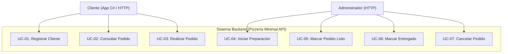
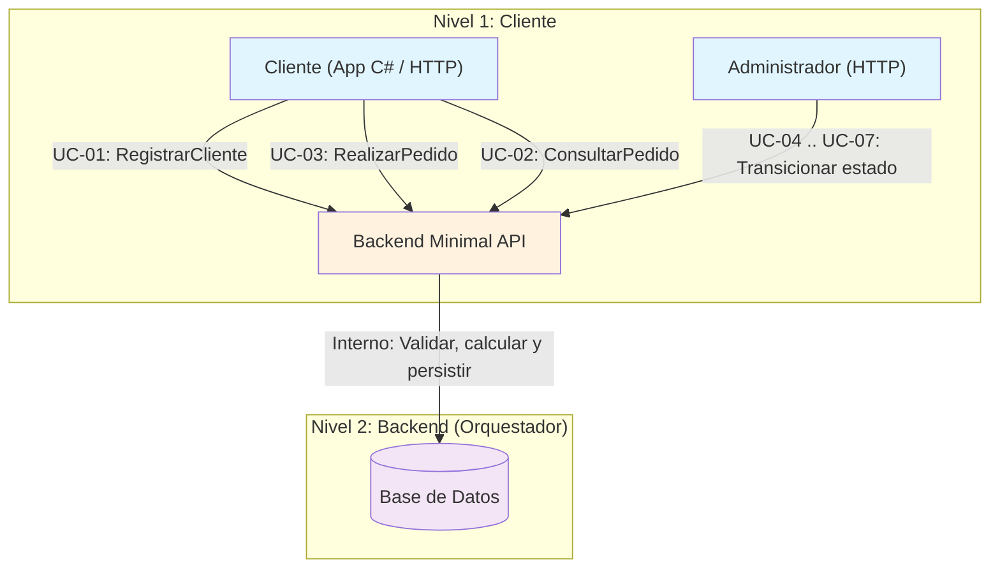

# Casos de Uso — PizzeriaAPI
**Curso:** Computación — ET12 DE1

---

## 1. Listado General de Casos de Uso

### Actor: Cliente
| Código | Nombre | Descripción |
|--------|--------|-------------|
| **UC-01** | Registrar Cliente | El cliente introduce sus datos básicos para obtener su identificador del sistema. |
| **UC-02** | Consultar Pedido | El cliente monitorea el estado de su orden activa. |
| **UC-03** | Realizar Pedido | El cliente confirma su lista de compras, gatillando el flujo de negocio de la API. |

### Actor: Administrador (gestiona los pedidos)
| Código | Nombre | Descripción |
|--------|--------|-------------|
| **UC-04** | Iniciar Preparación | El administrador cambia el estado del pedido a `EnPreparacion` vía HTTP. |
| **UC-05** | Marcar Pedido Listo | El administrador cambia el estado a `EnViaje` cuando las pizzas están listas. |
| **UC-06** | Marcar Entregado | El administrador cambia el estado a `Entregado` cuando se entrega al cliente. |
| **UC-07** | Cancelar Pedido | El administrador anula un pedido cambiando el estado a `Cancelado`. |

---

## 2. Diagrama General de Casos de Uso

Este diagrama modela los límites del sistema y sus actores:



---

## 3. Diseño Jerárquico y Delegación de Responsabilidades

El sistema sigue una estructura de delegación en dos niveles. El cliente delega operaciones al backend, y el backend persiste en la base de datos:



### Relación de delegación

| Nivel | Actor | Responsabilidad | Delega a | ¿Cómo? |
|-------|-------|----------------|----------|--------|
| **1** | Cliente | Iniciar el proceso, consultar resultados | Backend (API) | HTTP REST |
| **1** | Administrador | Avanzar estados de los pedidos | Backend (API) | HTTP REST |
| **2** | Backend | Validar, persistir, gestionar estados | Base de Datos | SQL |

### Flujo de delegación por caso de uso

```
UC-03 (Realizar Pedido):
  Cliente ──HTTP POST──> Backend
                            ├── Validar y persistir pedido (EsperaConfirmacion)
                            └── Responder 201

UC-04..07 (Transiciones de estado):
  Admin ──HTTP PATCH──> Backend
                            ├── Validar que el pedido existe
                            ├── Actualizar estado + historial
                            └── Responder 200

UC-02 (Consultar Pedido):
  Cliente ──HTTP GET──> Backend
                            └── Leer de BD y responder
```