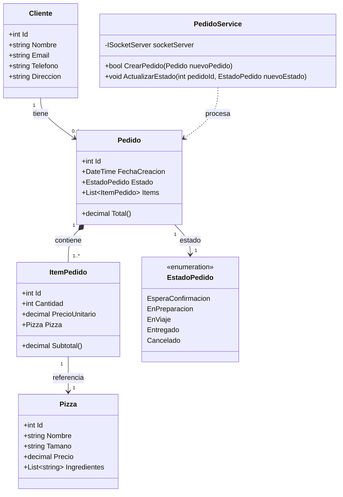
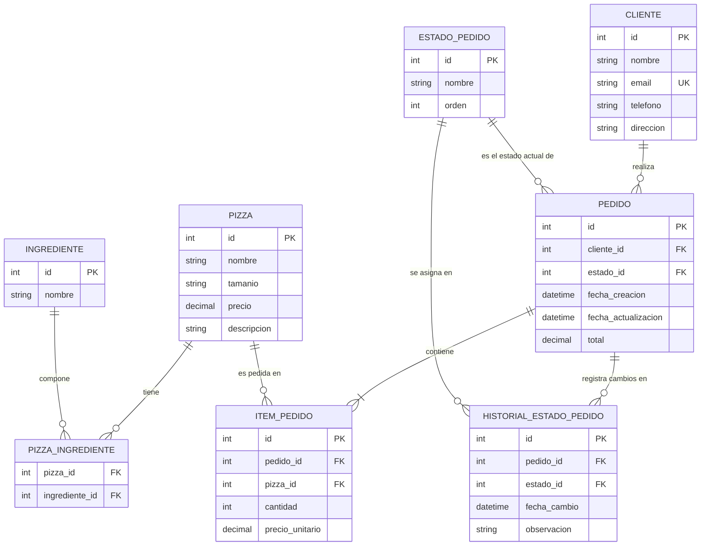

# Relevamiento y Diseño Estructurado — Actividad 2
**Proyecto:** "Tu app pide una pizza... y la API se la entrega"
**Curso:** Computación — ET12 DE1

---

## 1. Relevamiento Funcional

### 1.1 Límites del Sistema y Actores
Para el diseño de casos de uso del sistema distribuido, se identifican los siguientes **Actores Externos** que interactúan con el **Límite del Sistema (Backend / API REST)**.

| Actor | Rol | Canal de Comunicación |
| :--- | :--- | :--- |
| **Cliente** | Usuario final que selecciona las pizzas, arma y envía la orden. | Aplicación Cliente (C#) → API REST (HTTP) |
| **Servicio de Cocina** | Proceso independiente automatizado que recibe el pedido y simula la preparación. | Backend → Socket TCP (Mensajes asíncronos) |
| **Servicio de Reparto** | Proceso independiente que toma el pedido listo y simula la logística de entrega. | Backend → Socket TCP (Mensajes asíncronos) |

> **Nota de Análisis:** El Backend no se considera un actor, sino el sistema en sí mismo que orquesta el flujo, procesa las peticiones HTTP y delega las tareas a través de sockets a los servicios externos.

### 1.2 Entidades de Negocio
Para asegurar que el sistema soporte pedidos reales y mantenga la consistencia de los datos, se definen las siguientes entidades:

* **Cliente:** Contiene los datos de identificación y localización del usuario final. Por diseño solicitado en la consigna, **no posee contraseña ni lógica de autenticación**.
* **Pizza:** Actúa como catálogo de productos disponibles en la pizzería (Nombre, Tamaño, Precio base).
* **ItemPedido (Entidad de Soporte):** Representa la línea intermedia que desacopla la Pizza del Pedido. Permite solicitar múltiples cantidades de una misma pizza y congelar el `precio_unitario` histórico al momento de la compra.
* **Pedido:** Entidad central que unifica al Cliente, la lista de Items y el estado del ciclo de vida de la orden.
* **EstadoPedido (Enumerador):** Define estrictamente los estados requeridos: `EsperaConfirmacion`, `EnPreparacion`, `EnViaje`, `Entregado`. Se añade `Cancelado` para el tratamiento de excepciones de red.

### 1.3 Ciclo de Vida del Pedido (Máquina de Estados)
* **EsperaConfirmacion → EnPreparacion:** Ocurre cuando el Backend procesa la orden y el Servicio de Cocina confirma la recepción exitosa por socket.
* **EnPreparacion → EnViaje:** Ocurre una vez que la cocina notifica de manera asíncrona que las pizzas están listas.
* **EnViaje → Entregado:** Fin del ciclo, cuando el repartidor confirma la entrega efectiva al cliente.
* **Transiciones de Error (Hacia `Cancelado`):** Si durante el estado de *EsperaConfirmacion* el socket con la cocina sufre un timeout o rechazo de conexión, el pedido se cancela para evitar inconsistencias distribuidas.

---

## 2. Diagrama de Clases (Arquitectura de Software)

Este diagrama modela los objetos en memoria para la aplicación C#. Se desacopla la lógica de red de las entidades de datos mediante la clase controladora `PedidoService`.



---

## 3. Modelo de Datos Relacional

A continuación se presenta el modelo de entidades y relaciones para la base de datos:



## 4. Diagrama de Secuencia del Pedido

Este diagrama describe la interacción entre el cliente, el backend y los servicios de cocina y reparto, destacando el desacople temporal entre la respuesta HTTP y los eventos asíncronos por socket:

```mermaid
sequenceDiagram
    autonumber
    actor Cliente as Cliente (App C#)
    participant API as Backend (Minimal API)
    participant Cocina as Servicio Cocina (Socket)
    participant Reparto as Servicio Reparto (Socket)

    %% 1. Solicitud inicial HTTP
    Cliente->>API: POST /api/pedidos (items, clienteId)
    activate API
    API->>API: Validar y persistir Pedido (Estado: EsperaConfirmacion)

    %% 2. Intento de conexión por Socket con Cocina
    API->>Cocina: Conectar TCP + enviar datos del pedido
    activate Cocina

    alt Flujo normal
        Cocina-->>API: ACK (recepción exitosa)
        API->>API: Estado = EnPreparacion
        API-->>Cliente: HTTP 201 Created (pedidoId, Estado: EnPreparacion)
        deactivate API

        Note over Cliente, API: La respuesta HTTP se envía de inmediato.<br/>Los cambios de estado siguientes ocurren<br/>de forma asíncrona vía eventos socket.

        %% 3. Evento asíncrono: Cocina termina
        Note over Cocina: Hilo secundario simula cocción
        Cocina->>Cocina: Preparar pizza (delay)
        Cocina-->>API: Socket → "PedidoPreparado"
        deactivate Cocina

        API->>API: Estado = EnViaje

        %% 4. Asignación a Reparto
        API->>Reparto: Conectar TCP + asignar logística
        activate Reparto
        Note over Reparto: Hilo secundario simula traslado
        Reparto->>Reparto: Realizar entrega (delay)
        Reparto-->>API: Socket → "PedidoEntregado"
        deactivate Reparto
        API->>API: Estado = Entregado

    else Flujo de error
        Cocina--x API: Timeout / Conexión rechazada
        API->>API: Log error + Estado = Cancelado
        API-->>Cliente: HTTP 503 (Cocina no disponible)
        deactivate API
    end

    %% 5. Consulta de estado (polling HTTP)
    Note over Cliente, API: El cliente consulta el estado actual vía GET
    Cliente->>API: GET /api/pedidos/{id}
    activate API
    API-->>Cliente: HTTP 200 (Estado actual del pedido)
    deactivate API
```
