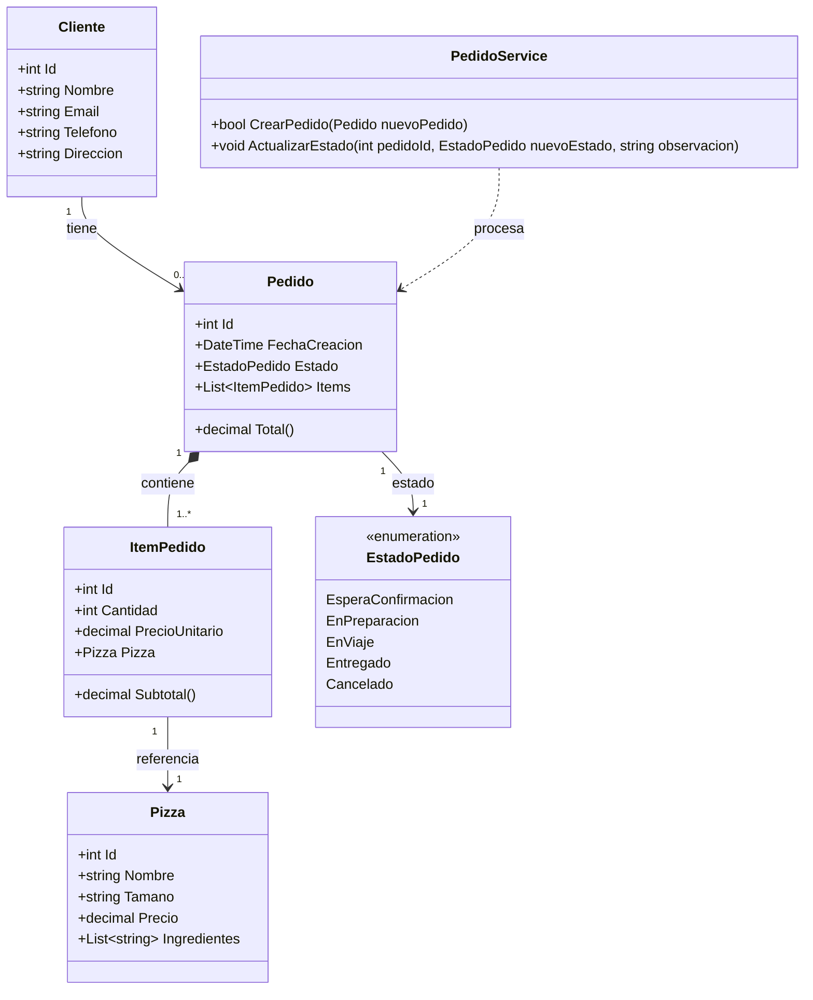
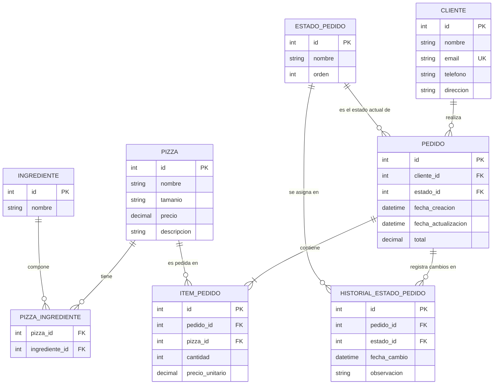
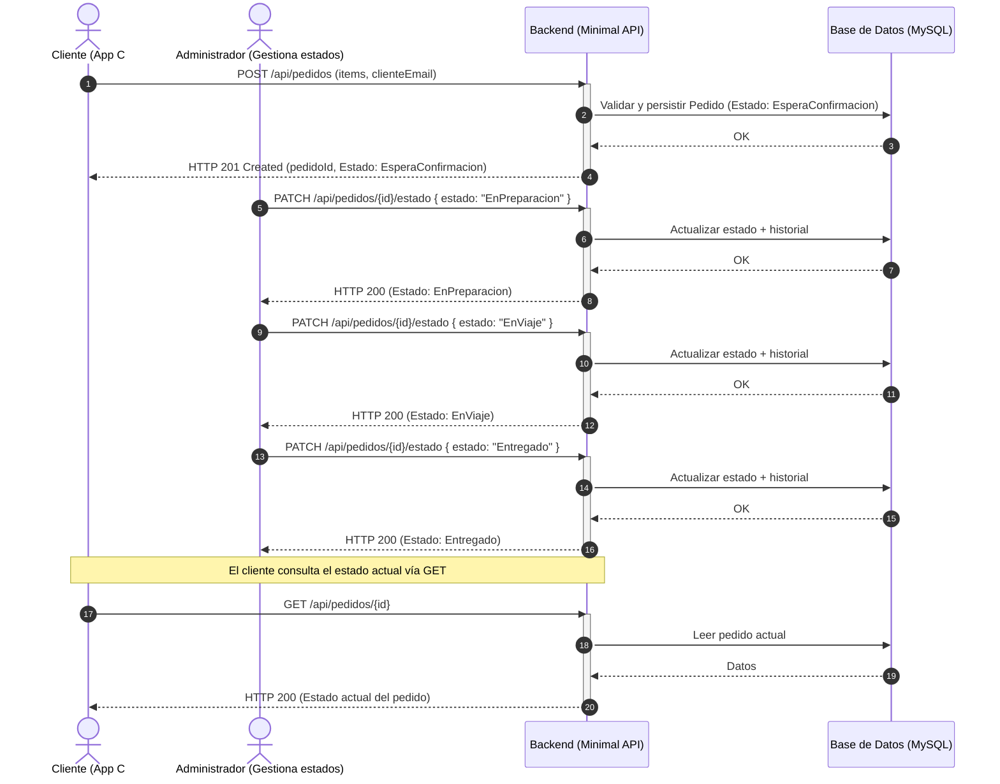

# Relevamiento y Diseño Estructurado — Actividad 2
**Proyecto:** "Tu app pide una pizza... y la API se la entrega"
**Curso:** Computación — ET12 DE1

---

## 1. Relevamiento Funcional

### 1.1 Límites del Sistema y Actores
Para el diseño de casos de uso del sistema, se identifican los siguientes **Actores Externos** que interactúan con el **Límite del Sistema (Backend / API REST)**.

| Actor | Rol | Canal de Comunicación |
| :--- | :--- | :--- |
| **Cliente** | Usuario final que selecciona las pizzas, arma y envía la orden. | Aplicación Cliente (C#) o Scalar → API REST (HTTP) |
| **Administrador** | Usuario que gestiona el avance de los pedidos (inicia preparación, marca listo, marca entregado). | API REST (HTTP) |

> **Nota de Análisis:** El Backend es el sistema central monolítico que orquesta el flujo completo: procesa las peticiones HTTP, valida, persiste y gestiona la máquina de estados del pedido sin depender de procesos externos.

### 1.2 Entidades de Negocio
Para asegurar que el sistema soporte pedidos reales y mantenga la consistencia de los datos, se definen las siguientes entidades:

* **Cliente:** Contiene los datos de identificación y localización del usuario final. Por diseño solicitado en la consigna, **no posee contraseña ni lógica de autenticación**.
* **Pizza:** Actúa como catálogo de productos disponibles en la pizzería (Nombre, Tamaño, Precio base).
* **ItemPedido (Entidad de Soporte):** Representa la línea intermedia que desacopla la Pizza del Pedido. Permite solicitar múltiples cantidades de una misma pizza y congelar el `precio_unitario` histórico al momento de la compra.
* **Pedido:** Entidad central que unifica al Cliente, la lista de Items y el estado del ciclo de vida de la orden.
* **EstadoPedido (Enumerador):** Define estrictamente los estados requeridos: `EsperaConfirmacion`, `EnPreparacion`, `EnViaje`, `Entregado`. Se añade `Cancelado` para el tratamiento de pedidos anulados.

### 1.3 Ciclo de Vida del Pedido (Máquina de Estados)
* **EsperaConfirmacion → EnPreparacion:** Ocurre cuando el Backend recibe una petición HTTP (PATCH) que inicia la preparación del pedido.
* **EnPreparacion → EnViaje:** Ocurre cuando el Backend recibe una petición HTTP (PATCH) indicando que las pizzas están listas para enviar.
* **EnViaje → Entregado:** Fin del ciclo, cuando el Backend recibe una petición HTTP (PATCH) indicando que la entrega fue efectiva al cliente.
* **Transición de Error (Hacia `Cancelado`):** Un pedido puede cancelarse mediante una petición HTTP (PATCH) que lo anule. El estado `Cancellado` es gestionado y registrado en el historial como cualquier otra transición.

---

## 2. Diagrama de Clases (Arquitectura de Software)

Este diagrama modela los objetos en memoria para la aplicación C#. Se desacopla la lógica de red de las entidades de datos mediante la clase controladora `PedidoService`.

```mermaid
classDiagram
    class Cliente {
        +int Id
        +string Nombre
        +string Email
        +string Telefono
        +string Direccion
    }

    class Pizza {
        +int Id
        +string Nombre
        +string Tamano
        +decimal Precio
        +List~string~ Ingredientes
    }

    class ItemPedido {
        +int Id
        +int Cantidad
        +decimal PrecioUnitario
        +Pizza Pizza
        +decimal Subtotal()
    }

    class Pedido {
        +int Id
        +DateTime FechaCreacion
        +EstadoPedido Estado
        +List~ItemPedido~ Items
        +decimal Total()
    }

    class EstadoPedido {
        <<enumeration>>
        EsperaConfirmacion
        EnPreparacion
        EnViaje
        Entregado
        Cancelado
    }

    class PedidoService {
        +bool CrearPedido(Pedido nuevoPedido)
        +void ActualizarEstado(int pedidoId, EstadoPedido nuevoEstado, string observacion)
    }

    Cliente "1" --> "0..*" Pedido : tiene
    Pedido "1" *-- "1..*" ItemPedido : contiene
    ItemPedido "1" --> "1" Pizza : referencia
    Pedido "1" --> "1" EstadoPedido : estado
    PedidoService ..> Pedido : procesa
```

---

## 3. Modelo de Datos Relacional

A continuación se presenta el modelo de entidades y relaciones para la base de datos:

```mermaid
erDiagram
    CLIENTE {
        int id PK
        string nombre
        string email UK
        string telefono
        string direccion
    }

    PIZZA {
        int id PK
        string nombre
        string tamanio
        decimal precio
        string descripcion
    }

    INGREDIENTE {
        int id PK
        string nombre
    }

    PIZZA_INGREDIENTE {
        int pizza_id FK
        int ingrediente_id FK
    }

    ESTADO_PEDIDO {
        int id PK
        string nombre
        int orden
    }

    PEDIDO {
        int id PK
        int cliente_id FK
        int estado_id FK
        datetime fecha_creacion
        datetime fecha_actualizacion
        decimal total
    }

    ITEM_PEDIDO {
        int id PK
        int pedido_id FK
        int pizza_id FK
        int cantidad
        decimal precio_unitario
    }

    HISTORIAL_ESTADO_PEDIDO {
        int id PK
        int pedido_id FK
        int estado_id FK
        datetime fecha_cambio
        string observacion
    }

    CLIENTE ||--o{ PEDIDO : "realiza"
    PEDIDO ||--|{ ITEM_PEDIDO : "contiene"
    PIZZA ||--o{ ITEM_PEDIDO : "es pedida en"

    PIZZA ||--o{ PIZZA_INGREDIENTE : "tiene"
    INGREDIENTE ||--o{ PIZZA_INGREDIENTE : "compone"

    ESTADO_PEDIDO ||--o{ PEDIDO : "es el estado actual de"
    PEDIDO ||--o{ HISTORIAL_ESTADO_PEDIDO : "registra cambios en"
    ESTADO_PEDIDO ||--o{ HISTORIAL_ESTADO_PEDIDO : "se asigna en"
```

## 4. Diagrama de Secuencia del Pedido

Este diagrama describe la interacción entre el cliente (o el administrador), el backend y la base de datos, todo a través de HTTP sin depender de procesos externos:

```mermaid
sequenceDiagram
    autonumber
    actor Cliente as Cliente (App C# / Scalar)
    actor Admin as Administrador (Gestiona estados)
    participant API as Backend (Minimal API)
    participant DB as Base de Datos (MySQL)

    %% 1. Solicitud inicial HTTP
    Cliente->>API: POST /api/pedidos (items, clienteEmail)
    activate API
    API->>DB: Validar y persistir Pedido (Estado: EsperaConfirmacion)
    DB-->>API: OK
    API-->>Cliente: HTTP 201 Created (pedidoId, Estado: EsperaConfirmacion)
    deactivate API

    %% 2. Transición manual a EnPreparacion
    Admin->>API: PATCH /api/pedidos/{id}/estado { estado: "EnPreparacion" }
    activate API
    API->>DB: Actualizar estado + historial
    DB-->>API: OK
    API-->>Admin: HTTP 200 (Estado: EnPreparacion)
    deactivate API

    %% 3. Transición manual a EnViaje
    Admin->>API: PATCH /api/pedidos/{id}/estado { estado: "EnViaje" }
    activate API
    API->>DB: Actualizar estado + historial
    DB-->>API: OK
    API-->>Admin: HTTP 200 (Estado: EnViaje)
    deactivate API

    %% 4. Transición manual a Entregado
    Admin->>API: PATCH /api/pedidos/{id}/estado { estado: "Entregado" }
    activate API
    API->>DB: Actualizar estado + historial
    DB-->>API: OK
    API-->>Admin: HTTP 200 (Estado: Entregado)
    deactivate API

    %% 5. Consulta de estado (polling HTTP)
    Note over Cliente, API: El cliente consulta el estado actual vía GET
    Cliente->>API: GET /api/pedidos/{id}
    activate API
    API->>DB: Leer pedido actual
    DB-->>API: Datos
    API-->>Cliente: HTTP 200 (Estado actual del pedido)
    deactivate API
```
